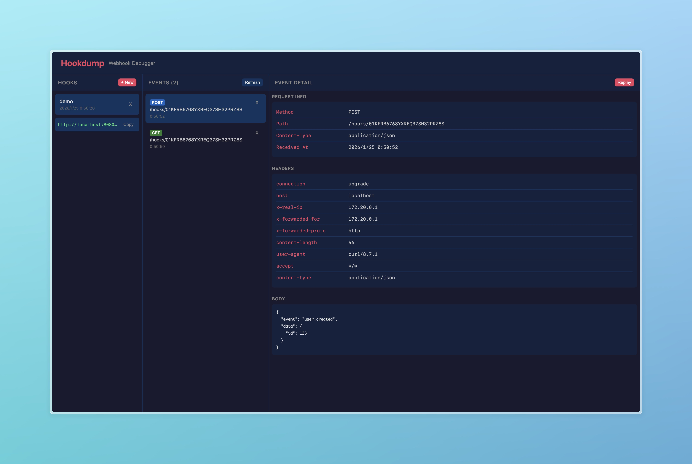

<p align="center">
  <h1 align="center">Hookdump</h1>
  <p align="center">
    <strong>Open-source webhook debugger. Receive, inspect, and replay webhooks.</strong>
  </p>
  <p align="center">
    <a href="https://hookdump.dev">Website</a> •
    <a href="#quick-start">Quick Start</a> •
    <a href="#features">Features</a> •
    <a href="#self-hosting">Self-Hosting</a>
  </p>
</p>

<p align="center">
  <a href="https://github.com/orangekame3/hookdump/blob/main/LICENSE">
    
  </a>
  <a href="https://github.com/orangekame3/hookdump">
    
  </a>
</p>

---

## Why Hookdump?

Webhook debugging tools like RequestBin and Webhook.site are **closed-source SaaS** products. Your sensitive webhook data goes through their servers.

**Hookdump is different:**

| Feature            | RequestBin    | Webhook.site  | Hookdump         |
| ------------------ | ------------- | ------------- | ---------------- |
| Open Source        | No            | No            | **Yes**          |
| Self-Hostable      | No            | No            | **Yes**          |
| Data Privacy       | Their servers | Their servers | **Your servers** |
| Free Tier Limits   | Limited       | Limited       | **Unlimited**    |
| Replay Webhooks    | No            | $9/mo         | **Free**         |
| Custom Response    | No            | $9/mo         | **Free**         |
| Webhook Forwarding | No            | $9/mo         | **Free**         |

> **Your webhook data stays on your infrastructure.** Perfect for teams handling sensitive data, compliance requirements, or air-gapped environments.

<p align="center">
  
</p>

## Features

- **Receive** - Create unique webhook URLs instantly
- **Inspect** - View headers, body, and metadata in a clean 3-pane UI
- **Replay** - Re-send captured webhooks to any target URL
- **Custom Response** - Configure status code, headers, and body for webhook responses
- **Webhook Forwarding** - Forward incoming webhooks to localhost or any URL (like ngrok)
- **Store** - SQLite-based storage, no external database needed
- **Self-Host** - One command Docker deployment

## Quick Start

### Docker (Recommended)

```bash
# Clone and start
git clone https://github.com/orangekame3/hookdump.git
cd hookdump
docker compose up -d

# Open http://localhost:8080
```

### Local Development

```bash
npm install
npm run build -w shared
npm run dev:backend   # Terminal 1
npm run dev:frontend  # Terminal 2
# Open http://localhost:5173
```

## Usage

1. **Create a Hook** - Click "+ New" and enter a name
2. **Copy the URL** - `http://localhost:8080/hooks/{hookId}`
3. **Send webhooks** to the URL:

```bash
curl -X POST http://localhost:8080/hooks/{hookId} \
  -H "Content-Type: application/json" \
  -d '{"event": "user.created", "data": {"id": 123}}'
```

4. **View** the captured request in the UI
5. **Replay** to forward the request to another endpoint

### Custom Response

Configure what your webhook endpoint returns (Webhook.site charges $9/mo for this):

```bash
curl -X PATCH http://localhost:8080/api/hooks/{hookId} \
  -H "Content-Type: application/json" \
  -d '{
    "responseStatusCode": 201,
    "responseHeaders": {"X-Custom": "Header"},
    "responseBody": "{\"success\": true}"
  }'
```

### Webhook Forwarding

Forward incoming webhooks to your local development server (like ngrok, but free):

```bash
curl -X PATCH http://localhost:8080/api/hooks/{hookId} \
  -H "Content-Type: application/json" \
  -d '{"forwardUrl": "http://localhost:3000/webhook"}'
```

Now webhooks sent to Hookdump will be:
1. Stored for inspection
2. Forwarded to your local server
3. Forward response recorded for debugging

## Self-Hosting

### Docker Compose (Local)

```bash
docker compose up -d
# Open http://localhost:8080
```

### Docker Compose + Cloudflare Tunnel (Production)

Expose to the internet for free using Cloudflare Tunnel:

```bash
# 1. Create tunnel at Cloudflare Zero Trust dashboard
# 2. Copy the tunnel token

# 3. Create .env file
cp .env.example .env
# Edit .env and set TUNNEL_TOKEN

# 4. Run with tunnel profile
docker compose --profile tunnel up -d
```

### Docker Compose (Cloud)

```yaml
services:
  backend:
    image: ghcr.io/orangekame3/hookdump-backend:latest
    volumes:
      - ./data:/app/data
    environment:
      - MAX_EVENTS_PER_HOOK=100

  frontend:
    image: ghcr.io/orangekame3/hookdump-frontend:latest
    ports:
      - "8080:80"
    depends_on:
      - backend
```

### Configuration

| Variable              | Default              | Description           |
| --------------------- | -------------------- | --------------------- |
| `PORT`                | `3000`               | Backend port          |
| `DATABASE_PATH`       | `./data/hookdump.db` | SQLite path           |
| `MAX_EVENTS_PER_HOOK` | `100`                | Event retention limit |

## Architecture

```
hookdump/
├── shared/      # Zod schemas (TypeScript types)
├── backend/     # Fastify + Drizzle ORM + SQLite
├── frontend/    # React + Vite
└── compose.yaml
```

**Tech Stack:**
- Backend: Fastify, Drizzle ORM, better-sqlite3
- Frontend: React 18, Vite, TypeScript
- Shared: Zod for schema validation

## API Reference

### Health Check

- `GET /health` - Returns `{"status": "ok"}` when the server is running

### Webhook Receiver

- `* /hooks/:hookId` - Receive webhook (any HTTP method)

### Management API
- `POST /api/hooks` - Create hook
- `GET /api/hooks` - List hooks
- `GET /api/hooks/:hookId` - Get hook details
- `PATCH /api/hooks/:hookId` - Update hook (custom response, forwarding URL)
- `DELETE /api/hooks/:hookId` - Delete hook
- `GET /api/hooks/:hookId/events` - List events
- `GET /api/events/:eventId` - Get event details
- `DELETE /api/events/:eventId` - Delete event
- `POST /api/events/:eventId/replay` - Replay event
- `GET /api/events/:eventId/replays` - Replay history

## Support

If you find Hookdump useful, consider supporting:

[](https://github.com/sponsors/orangekame3)
[](https://buymeacoffee.com/miyaorg030m)

## Contributing

Contributions are welcome! See [CONTRIBUTING.md](CONTRIBUTING.md) for guidelines.

## License

MIT - See [LICENSE](LICENSE) for details.

---

<p align="center">
  <a href="https://hookdump.dev">hookdump.dev</a> — Built for developers who care about data privacy.
</p>
